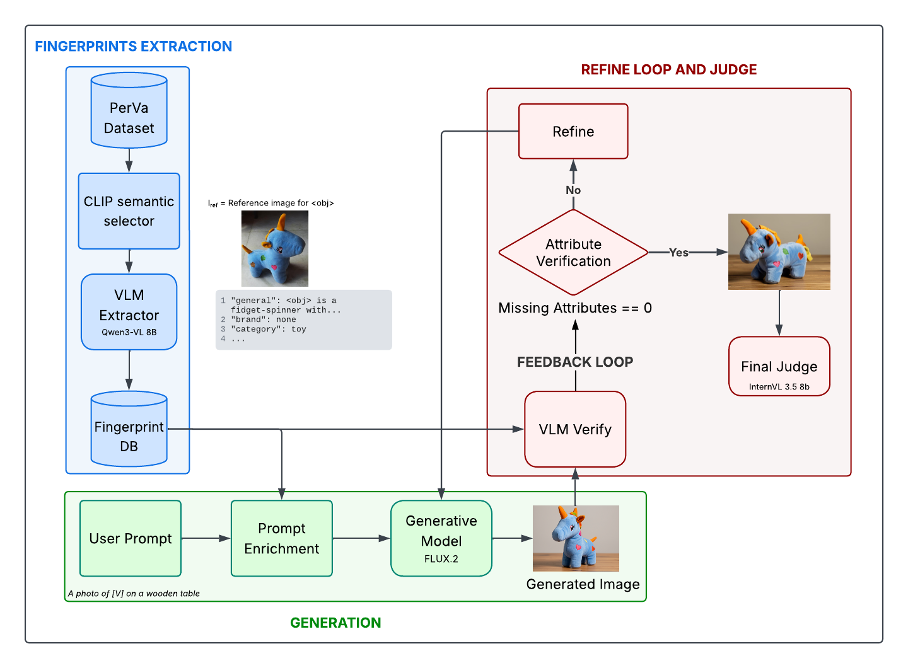

# R2P-GEN: Retrieval and Reasoning for Personalization — Generative Edition

<p align="center">
  <a href="LICENSE"></a>
  
  
  
  
</p>

---

## Abstract

**R2P-GEN** is a zero-shot, tuning-free framework for subject-driven Text-to-Image personalization. Existing adapter-based methods (e.g., IP-Adapter) suffer from background entanglement and prompt override, while parameter-update approaches (e.g., DreamBooth, LoRA) impose prohibitive computational costs at inference time. Our method addresses both limitations by coupling the native generative power of **FLUX.2**, leveraging its T5 text encoder for dense semantic binding, with the visual reasoning capabilities of **Vision Language Models (VLMs)**. Subject identity is encoded entirely through structured textual fingerprints, eliminating any need for adapter modules or weight fine-tuning. A closed-loop, VLM-guided refinement stage automatically recovers missing visual attributes through escalating prompt revision, and an isolated independent judge provides unbiased final evaluation.

---

## Key Features

- **Zero-Shot & Tuning-Free:** No adapter weights, no LoRA, no per-subject fine-tuning. The framework runs entirely at inference time.
- **T5-Driven Dense Textual Anchoring:** Visual identity is encoded as structured natural language, exploiting the superior semantic binding capacity of the T5 encoder in FLUX.2.
- **VLM Visual Fingerprinting:** Qwen3-VL extracts distinctive attributes (logos, textures, typographic elements) from reference images into a structured JSON database.
- **Hierarchical Attribute Verification:** A two-phase verification module detects missing attributes with continuous probability scores.
- **Closed-Loop Refinement:** An automated recovery loop rewrites the generation prompt with increasing intensity (semantic emphasis → hard typographic anchors) and regenerates up to three times.
- **Independent Final Judge:** A fully isolated VLM (InternVL3.5) evaluates final outputs with Visual Question Answering (VQA), preventing self-evaluation bias.

---

## Pipeline Architecture

## Pipeline Architecture

R2P-GEN is a five-stage modular pipeline orchestrated by `flux_loop.py`.

<p align="center">
  
</p>

### Stage Details

### Stage Details

**Stage 0: Build Database.** Processes a subject dataset (PerVA or DreamBench). A Text-Driven Semantic View Selection step, guided by CLIP, discards noisy or ambiguous views and identifies the single most canonical reference image per subject. Qwen3-VL then extracts structured visual fingerprints — capturing distinctive attributes such as logos, textures, typography, and color patterns — and serializes them into a JSON database.

**Stage 1: Generate Only.** The JSON fingerprints are programmatically translated into a Dense Textual Anchor. This anchor, together with the reference image, is passed to FLUX.2-klein-9B operating in Image-to-Image mode (4 inference steps) to generate the subject in a novel context. No external adapter modules are used.

**Stage 2: Verify Base.** Each generated image undergoes hierarchical attribute verification. A lightweight CLIP-based quick-reject filters obviously failing generations. Passing images are then subjected to a Logit-Based MLLM Sweep: Qwen3-VL extracts per-token logits to compute a continuous presence probability for each fingerprint attribute. A **Worst-K Detection** policy flags any image where even a single critical attribute is catastrophically absent, routing it to the refinement stage.

**Stage 3: Refine.** Rejected images enter a closed recovery loop (maximum 3 iterations). Qwen3-VL acts as an automated Prompt Engineer, applying an **Escalating Prompt Revision** strategy: initial iterations apply semantic emphasis; subsequent iterations escalate to hard typographic anchors (UPPERCASE tokens) for attributes that remain unresolved. Each revised prompt triggers a new generation and verification pass.

**Stage 4: Final Judge.** To eliminate self-evaluation bias, the final assessment is performed by an entirely separate and isolated model, InternVL3.5-8B, which was not involved in any prior stage. It computes CLIP-I (global identity similarity), CLIP-T (text-image alignment), DINO-I via DINOv2 (fine-grained structural fidelity), and a VQA-based TIFA Score (exact attribute verification).

---

## Repository Structure

```
R2P-GEN/
├── pipeline/               # Core pipeline modules
│   ├── generate.py         # Stage 1: FLUX.2 image generation
│   ├── verify.py           # Stage 2: hierarchical attribute verification
│   ├── refine.py           # Stage 3: closed-loop prompt revision
│   ├── judge.py            # Stage 4: final independent evaluation
│   ├── prompts/            # Prompt templates (flux_prompts.py, etc.)
│   └── r2p_tools.py        # Shared utilities (CLIP scorer, etc.)
├── r2p_core/               # Core model wrappers
│   ├── evaluators/         # CLIP, DINOv2 evaluator classes
│   ├── models/             # Qwen3-VL reasoning interface
│   └── utils/              # GPU cleanup, I/O helpers
├── scripts/                # Slurm cluster scripts
│   ├── run_full_e2e.sh     # End-to-end pipeline run
│   └── ablation_*.sh       # Ablation study scripts
├── data/                   # Dataset directory (user-provided)
├── database/               # Generated fingerprint databases
├── output/                 # Generated images and evaluation results
├── archive/                # Experimental/archived code
├── metrics/                # Metric computation utilities
├── build_database.py       # Stage 0: fingerprint database construction
├── flux_loop.py            # Main pipeline orchestrator
├── flux_server.py          # Background HTTP server for FLUX in VRAM
├── config.py               # Centralized configuration
├── prepare_dreambench.py   # DreamBench dataset preparation utility
├── analyze_judge_scores.py # Score analysis and dashboard utilities
├── requirements.txt        # Standard Python dependencies
├── requirements_cluster.txt# Cluster-specific dependencies
└── .env                    # Environment variable overrides (not tracked)
```

---

## Installation

### Prerequisites

- Python 3.10+
- CUDA-capable GPU (≥ 24 GB VRAM recommended; 40+ GB for full pipeline)
- [Conda](https://docs.conda.io/en/latest/) or a Python virtual environment

### Environment Setup

```bash
# Clone the repository
git clone https://github.com/tommaso-ballarini/R2P-GEN.git
cd R2P-GEN

# Create and activate a conda environment
conda create -n r2pgen python=3.10 -y
conda activate r2pgen

# Install dependencies
pip install -r requirements.txt
```

For cluster environments with custom module paths, use the cluster-specific requirements:

```bash
pip install -r requirements_cluster.txt
```

### Environment Variables

R2P-GEN uses environment variables for flexible path configuration. Copy `.env.example` to `.env` and adjust as needed, or export them directly:

| Variable | Description | Default |
|---|---|---|
| `R2P_CLUSTER_MODE` | Enable cluster path layout (`true`/`false`) | `false` |
| `R2P_MODELS_BASE` | Base directory for locally cached model weights | *(HuggingFace Hub)* |
| `HF_HOME` | Override HuggingFace cache directory | *(HF default)* |
| `R2P_FLUX_MODEL` | Path or repo ID for the FLUX model | `black-forest-labs/FLUX.1-schnell` |
| `R2P_OUTPUT_DIR` | Output directory (cluster mode only) | `output/` |

When `R2P_MODELS_BASE` is not set, all models are downloaded automatically from HuggingFace Hub on first use.

---

## Dataset Preparation

R2P-GEN supports two standard personalization benchmarks:

- **DreamBench** — available at [dreambooth.github.io](https://dreambooth.github.io/)
- **PerVA** — available at [deepayan137.github.io/papers/training-free-personalization](https://deepayan137.github.io/papers/training-free-personalization.html)

Download and place datasets under `data/`. DreamBench can be prepared using the provided utility:

```bash
python prepare_dreambench.py
```

---

## Usage

### Step 1 — Start the FLUX Server

The FLUX model is kept resident in VRAM via a background HTTP server to avoid repeated loading across pipeline stages. Start it before any pipeline run:

```bash
python flux_server.py
```

The server listens on `http://127.0.0.1:8767` by default. Keep this process running in a separate terminal or tmux session throughout the experiment.

### Step 2 — Build the Fingerprint Database

```bash
python build_database.py
```

This runs Stage 0: CLIP-based view selection followed by Qwen3-VL fingerprint extraction. Output is written to `database/database.json`.

### Step 3 — Run the Pipeline

All pipeline stages are invoked through `flux_loop.py` via the `--stage` argument.

**Full automatic pipeline (recommended):**

```bash
python flux_loop.py \
    --database database/database.json \
    --output output/ \
    --stage full_auto
```

**Individual stages:**

```bash
# Stage 1: Generate images from fingerprints
python flux_loop.py --database database/database.json --output output/ --stage generate_only

# Stage 2: Verify generated images
python flux_loop.py --database database/database.json --output output/ --stage verify_base

# Stage 3: Refine rejected images
python flux_loop.py --database database/database.json --output output/ --stage refine

# Stage 4: Run final independent evaluation
python flux_loop.py --database database/database.json --output output/ --stage final_judge
```

**Distributed generation with sharding (for cluster use):**

```bash
# Run shard 0 of 4
python flux_loop.py \
    --database database/database.json \
    --output output/ \
    --stage generate_only \
    --num-shards 4 \
    --shard-index 0
```

### Ablation Studies

Two flags expose key architectural components for controlled ablation:

```bash
# Ablation 1: Naive prompt baseline (no fingerprints, no dense anchoring)
python flux_loop.py --database database/database.json --output output_naive/ \
    --stage generate_only --naive-prompt

# Ablation 2: Text-only generation (no image conditioning, T2I instead of I2I)
python flux_loop.py --database database/database.json --output output_t2i/ \
    --stage generate_only --no-image-cond
```

For end-to-end Slurm cluster runs, refer to the scripts in `scripts/`:

```bash
sbatch scripts/run_full_e2e.sh
```

---

## Evaluation

R2P-GEN uses a four-metric evaluation protocol computed by the **Final Judge** (InternVL3.5-8B), which operates independently from all prior pipeline stages to prevent self-evaluation bias.

| Metric | Model | Measures |
|---|---|---|
| **CLIP-I** | CLIP ViT-L/14 | Global visual identity similarity (generated vs. reference) |
| **CLIP-T** | CLIP ViT-L/14 | Text-image alignment (generated image vs. input prompt) |
| **DINO-I** | DINOv2 ViT-L/14 | Fine-grained structural and semantic fidelity |
| **TIFA Score** | InternVL3.5-8B (VQA) | Exact attribute verification via visual question answering |

Results are written to `output/final_judge_results.json`. Aggregate score analysis can be performed with:

```bash
python analyze_judge_scores.py --results output/final_judge_results.json
```

---

## Configuration

All hyperparameters and model paths are centralized in `config.py`. Key settings:

| Config class | Parameter | Default | Description |
|---|---|---|---|
| `Config.Generate` | `NUM_INFERENCE_STEPS` | `4` | FLUX denoising steps |
| `Config.Generate` | `BACKGROUND_STYLE` | `wooden_table` | Background template for generation |
| `Config.Refine` | `MAX_ITERATIONS` | `3` | Max refinement attempts per concept |
| `Config.Refine` | `TARGET_ACCURACY` | `0.95` | Target attribute verification score |
| `Config.Images` | `OUTPUT_IMAGE_SIZE` | `1024` | Output resolution (px) |

---

## Acknowledgements

This project was developed as part of the Foundation Models course for the Master's degree in Data Science at the University of Trento.
